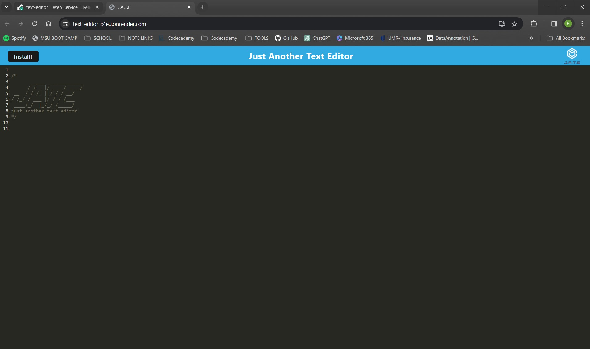
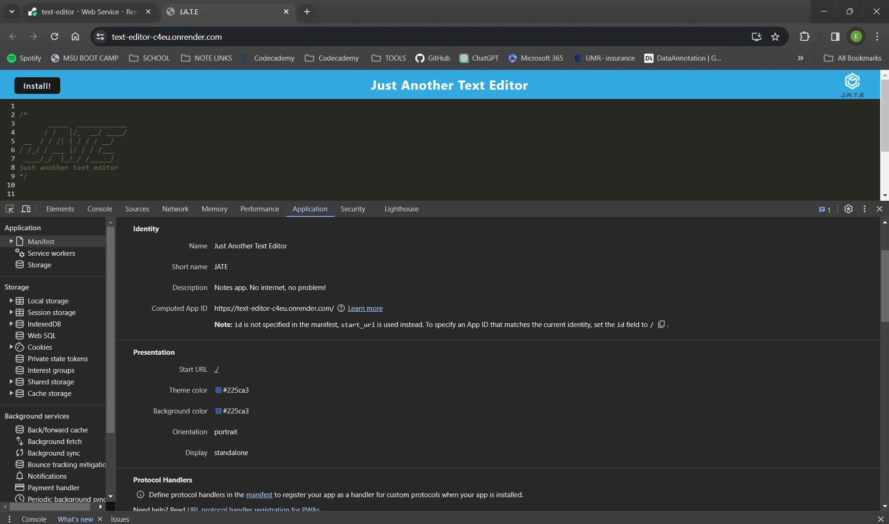
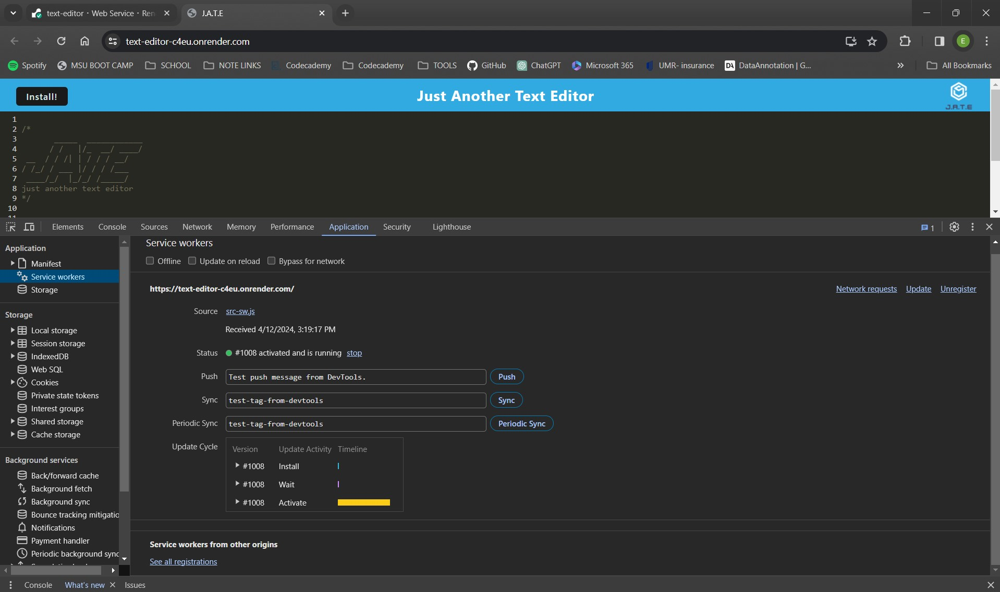
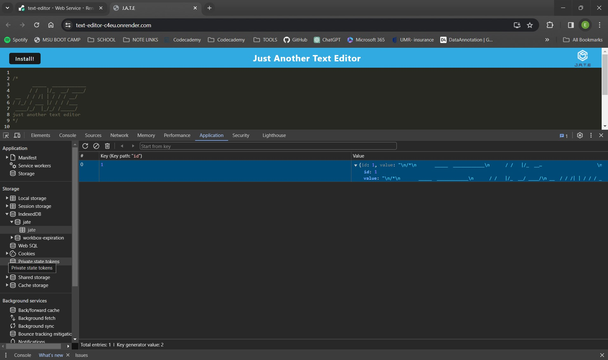

# text-editor

## Description

This is a Progressive Web Application that is a text editor. This application allows the user to write notes or code snippets with or without an internet connection. The user has the capability to install the application locally. The application functions offline and will allow the user to recall the data at a later time by storing the data to an IndexedDB database. 

## Installation

To run application locally:

* Clone repository
* Run `npm install`
* Invoke application by running `npm run start`

## Usage

GitHub repo link:

https://github.com/ebcoleman/text-editor

Live link using Render:

https://text-editor-c4eu.onrender.com/

Below is a screenshot of the the live application:

Below is a screenshot that shows the `manifest.json` file:

Below is a screenshot of the registered service worker:

Below is a screenshot of the IndexedDB storage:

## Credits

Starter code: 
https://github.com/coding-boot-camp/cautious-meme

https://github.com/stellalph/19-PWA-Text-Editor
https://git.bootcampcontent.com/Michigan-State-University/MSU-VIRT-FSF-PT-11-2023-U-LOLC.git
Asked questions on https://chat.openai.com/ to help troubleshoot situations where I was stuck.
